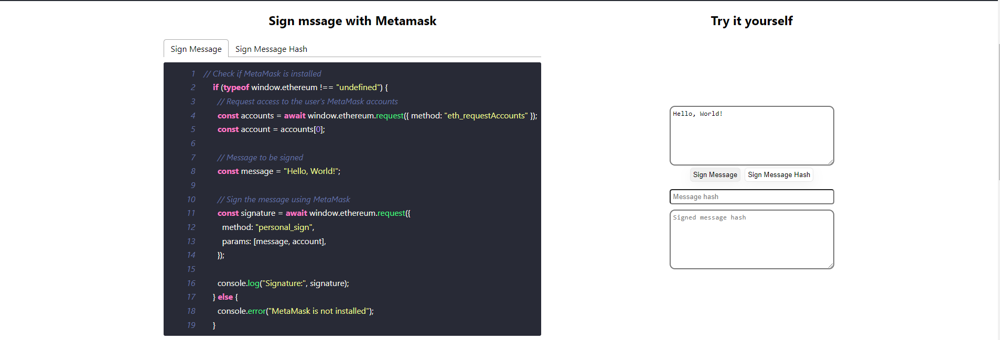
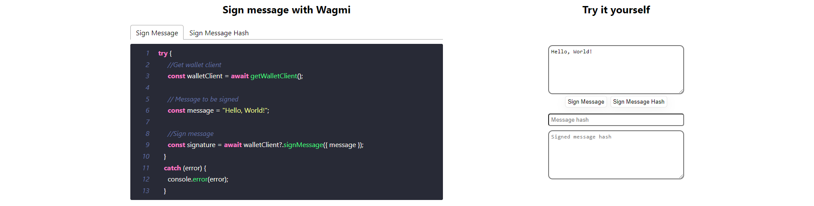

# Getting Started with onchain/offchain cryptograhpy on Ethereum

This project was bootstrapped with [Create React App](https://github.com/facebook/create-react-app), [Metamask](https://docs.metamask.io), [Rainbowkit](https://www.rainbowkit.com/docs/introduction), [Wagmi](https://wagmi.sh).


Runs the app in the development mode.\
Open [http://localhost:3000](http://localhost:3000) to view it in the browser.


## Sign plan message and hashed message with Metamask


Message signing using MetaMask is a process that involves using the MetaMask wallet to verify that you are the originator of a transaction or message. It provides a way to prove ownership of a specific Ethereum address and allows the transaction or message to be added to the blockchain.

Message signing with MetaMask is commonly used for various purposes, such as authentication, authorization, and secure exchanges of information . It provides a way to prove the ownership of an Ethereum address without revealing the private key.

Following code shows how does Metamask sign plan message in Javascript.
```javascript
// Check if MetaMask is installed
if (typeof window.ethereum !== "undefined") {
    // Request access to the user's MetaMask accounts
    const accounts = await window.ethereum.request({ method: "eth_requestAccounts" });
    const account = accounts[0];
    
    // Message to be signed
    const message = "Hello, World!";
    
    // Sign the message using MetaMask
    const signature = await window.ethereum.request({
        method: "personal_sign",
        params: [message, account],
    });
    
    console.log("Signature:", signature);
} else {
    console.error("MetaMask is not installed");
}
```

Following code shows how does Metamask sign hashed message in Javascript.
```javascript
// Check if MetaMask is installed
if (typeof window.ethereum !== "undefined") {
    // Request access to the user's MetaMask accounts
    const accounts = await window.ethereum.request({ method: "eth_requestAccounts" });
    const account = accounts[0];
    
    // Message to be signed
    const message = "Hello, World!";
    // Message hash
    const messageHash = ethers.keccak256(ethers.toUtf8Bytes(message))

    // Sign the message using MetaMask
    const signature = await window.ethereum.request({
        method: "personal_sign",
        params: [messageHash, account],
    });
    
    console.log("Signature:", signature);
} else {
    console.error("MetaMask is not installed");
}
```

## Sign plan message and hashed message with Rainbowkit and Wagmi SDK



Message signing using Wagmi involves using the Wagmi library, which provides React hooks for working with Ethereum. With Wagmi, you can sign messages to prove control of a specific Ethereum address securely.

It's important to note that before signing a message, the user's wallet needs to be connected to the browser and the application. This typically involves using a wallet connection provider like Rainbowkit.

Following code shows how to sign plan message with Wagmi in Javascript.

```javascript
try {
    //Get wallet client
    const walletClient = await getWalletClient();

    // Message to be signed
    const message = "Hello, World!";

    //Sign message 
    const signature = await walletClient?.signMessage({ message });                                        
}
catch (error) {
    console.error(error);
}
```

Following code shows how to sign hashed message with Wagmi in Javascript.

```javascript
 try {
    //Get wallet client
    const walletClient = await getWalletClient();

    // Message to be signed
    const message = "Hello, World!";
    // Message hash
    const messageHash = ethers.keccak256(ethers.toUtf8Bytes(message))

    //Sign message 
    const signature = await walletClient?.signMessage({ message: { raw: messageHash } });    
}
catch (error) {
    console.error(error);
}
```