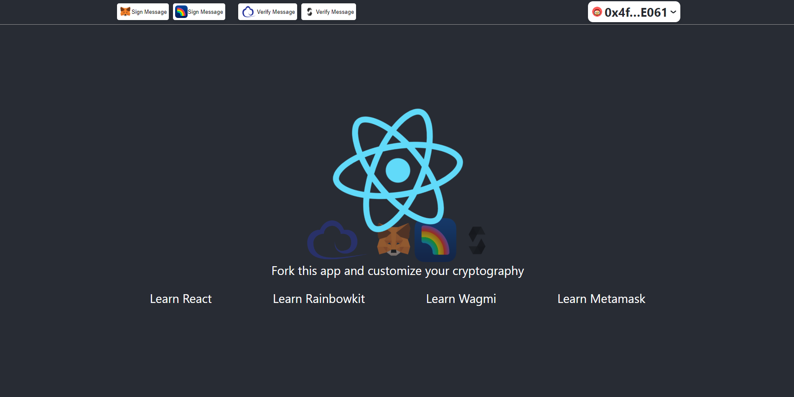

# Getting Started with onchain/offchain cryptograhpy on Ethereum

This project was bootstrapped with [Create React App](https://github.com/facebook/create-react-app), [Metamask](https://docs.metamask.io), [Rainbowkit](https://www.rainbowkit.com/docs/introduction), [Wagmi](https://wagmi.sh).

Runs the app in the development mode.\
Open [http://localhost:3000](http://localhost:3000) to view it in the browser.

The page will reload if you make edits.
